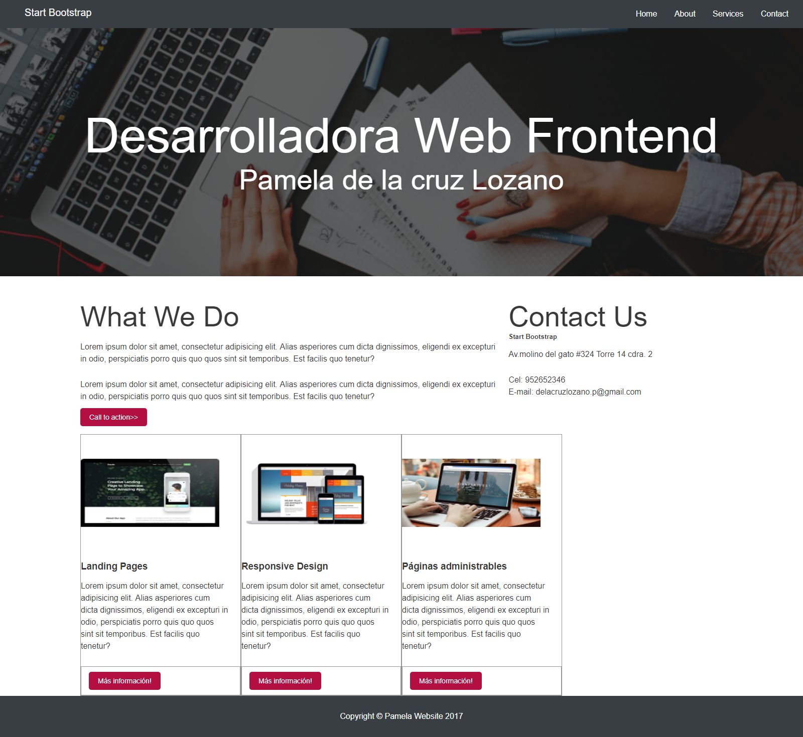

# RETO 2: Mi página

* **Curso:** _Responsive web Design_
* **Unidad 1:** _La web desde el móvil_
* **Tema** _Reto N° 2 -USO DE GRID SYSTEM, MEDIA QUERY Y MEDIA TYPE-_ 

***
## OBJETIVO
* Crea una página web con el diseño de tu preferencia, que sea responsive.

## Flujo de trabajo
* Creamos la página utilizando media query, media type y operadores lógicos para hacer responsive junto al diseño css. 
 
## Herramientas utilizadas

* HTML 5
* CSS 3

## PRODUCTO FINAL

* Vista desde la ventana del navegador a medida se haga más pequeña.

